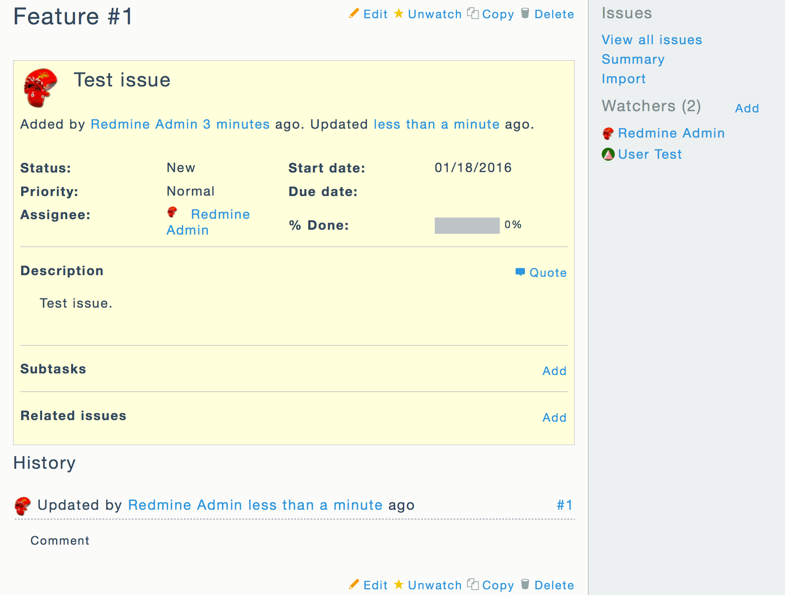

# minimalflat2


簡素でフラットな外観の Redmine テーマです。

## スクリーンショット

|                  Projects                   |                  Editor                   |
| :-----------------------------------------: | :---------------------------------------: |
| [](res/ss-01.png) | [](res/ss-02.png) |

|                  Issue                   |                  Settings                   |
| :--------------------------------------: | :-----------------------------------------: |
| [](res/ss-03.png) | [](res/ss-04.png) |

|                    Mobile                     |                  Menu                   |
| :-------------------------------------------: | :-------------------------------------: |
| [](res/ss-05.png) | [](res/ss-06.png) |

## 機能

- 簡素でフラットな外観
- モダンな配色
- [Flat UI](http://designmodo.github.io/Flat-UI/)
- [Espresso](https://github.com/mbadolato/iTerm2-Color-Schemes)
- 解像度に依存しないアイコン画像
- [IcoMoon](https://icomoon.io/)
- 開閉可能なプロジェクト一覧画面
- Favicon 対応 (Redmine 2.5 以降)
- Responsive 対応 (Redmine 3.2 以降)

## インストール方法

1. [release page](https://github.com/akabekobeko/redmine-theme-minimalflat2/releases) から最新版の ZIP ファイルをダウンロード
2. ZIP ファイルを展開して Redmine ディレクトリ内の `public/themes/minimalflat2` へ配置
3. Redmine 上部のメニューから**管理** - **設定** - **表示**を表示
4. **テーマ**欄から **minimalflat2** を選択して設定を保存

## 開発

開発環境を用意します。

```
$ git clone https://github.com/akabekobeko/redmine-theme-minimalflat2.git redmine-theme-minimalflat2
$ cd redmine-theme-minimalflat2
$ cd npm i
```

### CSS ビルド

`npm build` コマンドで SCSS ファイルが Transpile されて CSS ファイルが出力されます。

```
$ npm run build
```

`npm watch` コマンドで SCSS ファイル監視を開始します。変更を検知すると自動的に Transpile されます。

```
$ npm watch
```

このモードを中断させるには <kbd>Ctrl</kbd> + <kbd>C</kbd> を押してください。

### docker-compose

テーマを Redmine 上で動作確認する場合は以下を実行してください。

1. `docker-compose up -d`
2. Web ブラウザーで http://localhost:8080/ にアクセス
3. Redmine に管理者としてログイン
4. 管理画面からテーマとして `minimalflat2` を選択

停止コマンドは `docker-compose stop` です。

## ライブラリ

| Library                                                                 | Author                                          | License       |
| :---------------------------------------------------------------------- | :---------------------------------------------- | :------------ |
| [IcoMoon - Free](https://icomoon.io/#icons)                             | [Keyamoon](http://keyamoon.com/)                | GPL/CC BY 4.0 |
| [Entypo](http://www.entypo.com/)                                        | [Daniel Bruce](http://danielbruce.se/)          | CC BY-SA 4.0  |
| [bymathias/normalize.styl](https://github.com/bymathias/normalize.styl) | [Mathias Brouilly](http://mathias.brouilly.fr/) | MIT           |

## サポート方針

このテーマは Redmine 最新版のみに対応します。Redmine は minor バージョンごとに HTML や CSS の構成が大きく変更されます。そのため複数のバージョンへ同時に対応するのが難しいのです。

過去の Redmine 対応が必要な場合は旧バージョンを利用してください。

## 更新履歴

- [CHANGELOG](CHANGELOG.md)

## ライセンス

- [GNU GENERAL PUBLIC LICENSE Version 2](LICENSE.txt)
