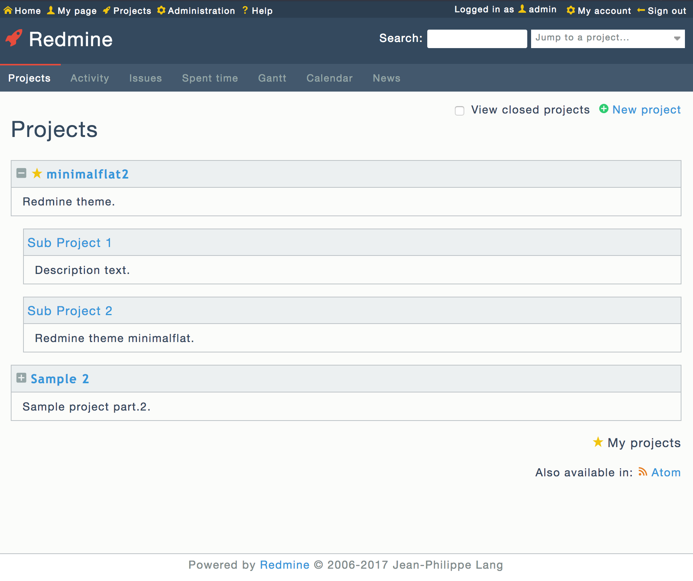
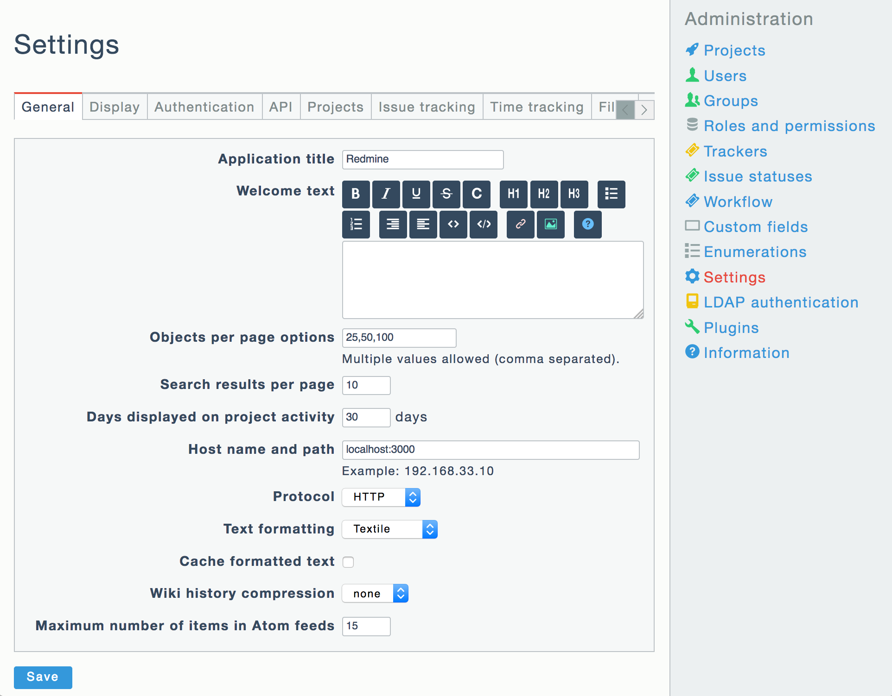
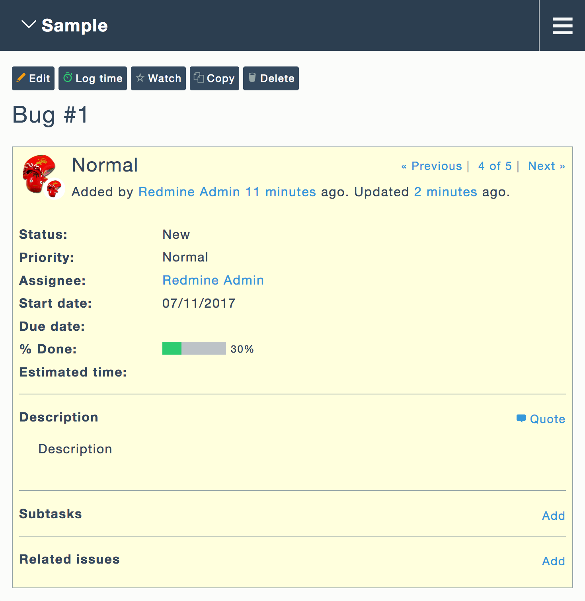
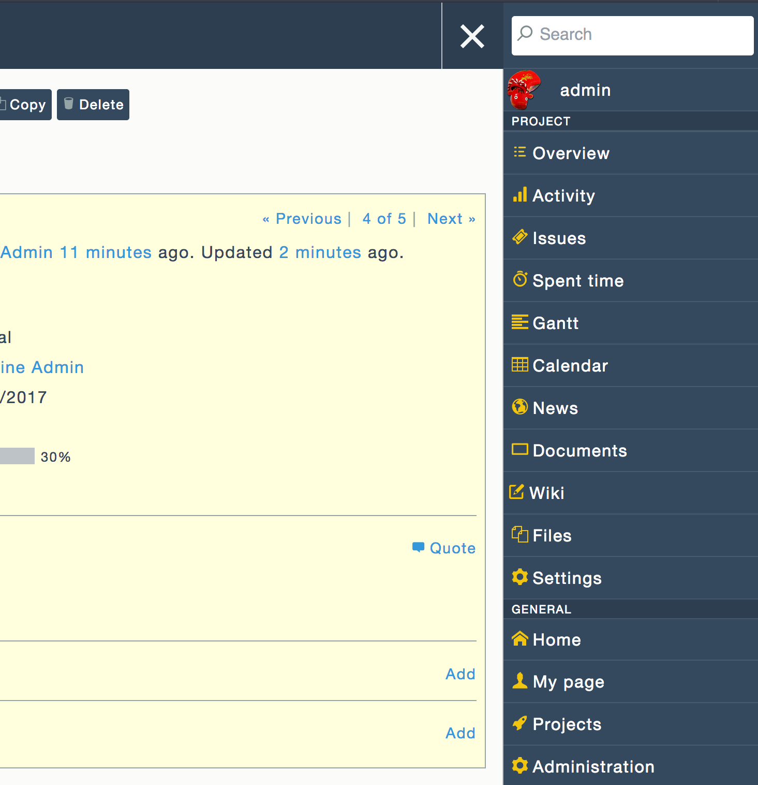

# minimalflat2

簡素でフラットな外観の Redmine テーマです。

## スクリーンショット

|Projects|Editor|
|:-:|:-:|
|||

|Issue|Settings|
|:-:|:-:|
|||

|Mobile|Menu|
|:-:|:-:|
|||

## 機能

* 簡素でフラットな外観
* モダンな配色
 * [Flat UI](http://designmodo.github.io/Flat-UI/)
 * [Espresso](https://github.com/mbadolato/iTerm2-Color-Schemes)
* 解像度に依存しないアイコン画像
 * [IcoMoon](https://icomoon.io/)
* 開閉可能なプロジェクト一覧画面
* Favicon 対応 (Redmine 2.5 以降)
* Responsive 対応 (Redmine 3.2 以降)

## インストール方法

1. [release page](https://github.com/akabekobeko/redmine-theme-minimalflat2/releases) から最新版の ZIP ファイルをダウンロード
2. ZIP ファイルを展開して Redmine ディレクトリ内の `public/themes/minimalflat2` へ配置
3. Redmine 上部のメニューから**管理** - **設定** - **表示**を表示
4. **テーマ**欄から **minimalflat2** を選択して設定を保存

## ライブラリ

|Library|Author|License|
|:--|:--|:--|
|[IcoMoon - Free](https://icomoon.io/#icons)|[Keyamoon](http://keyamoon.com/)|GPL/CC BY 4.0|
|[Entypo](http://www.entypo.com/)|[Daniel Bruce](http://danielbruce.se/)|CC BY-SA 4.0|
|[bymathias/normalize.styl](https://github.com/bymathias/normalize.styl)|[Mathias Brouilly](http://mathias.brouilly.fr/)|MIT|

## 更新履歴

* [CHANGELOG](CHANGELOG.md)

## ライセンス

* [GNU GENERAL PUBLIC LICENSE Version 2](LICENSE.txt)
