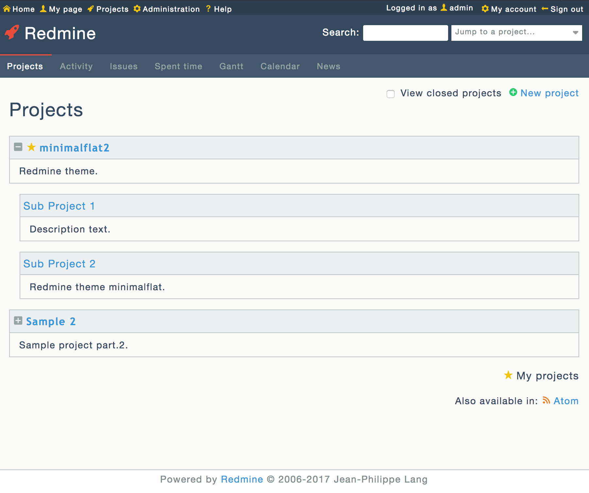
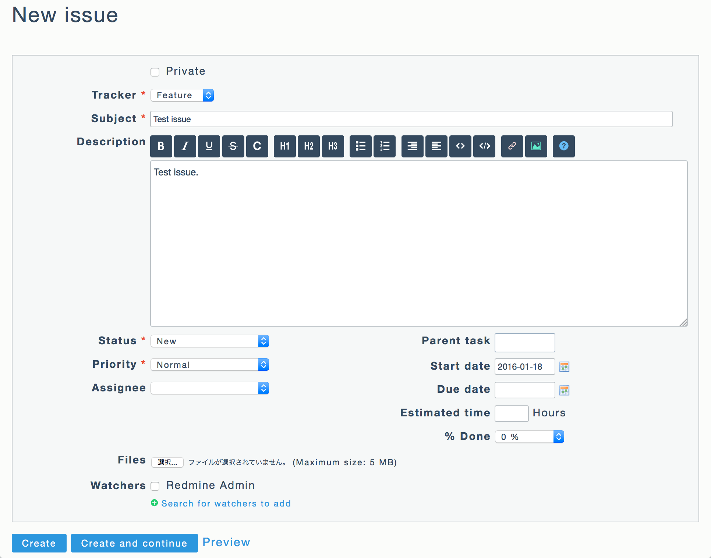
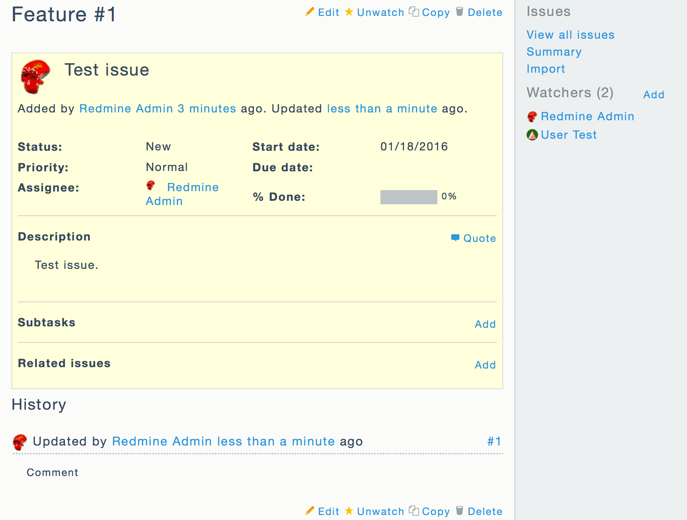
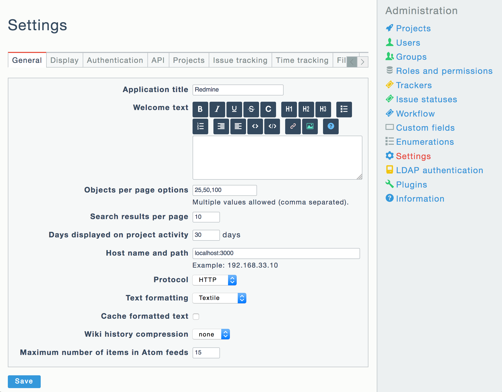
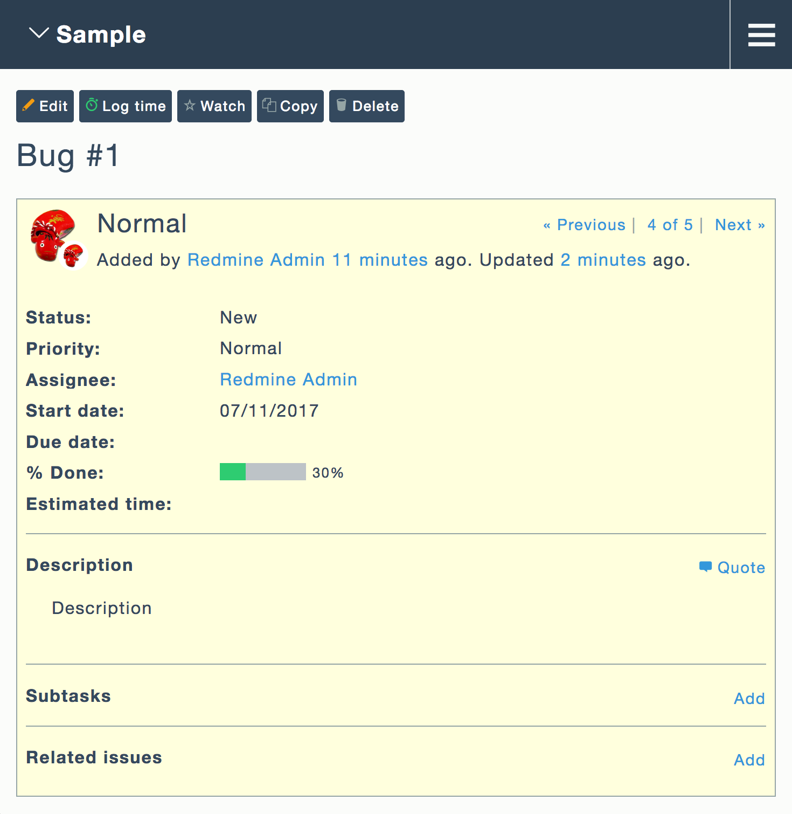
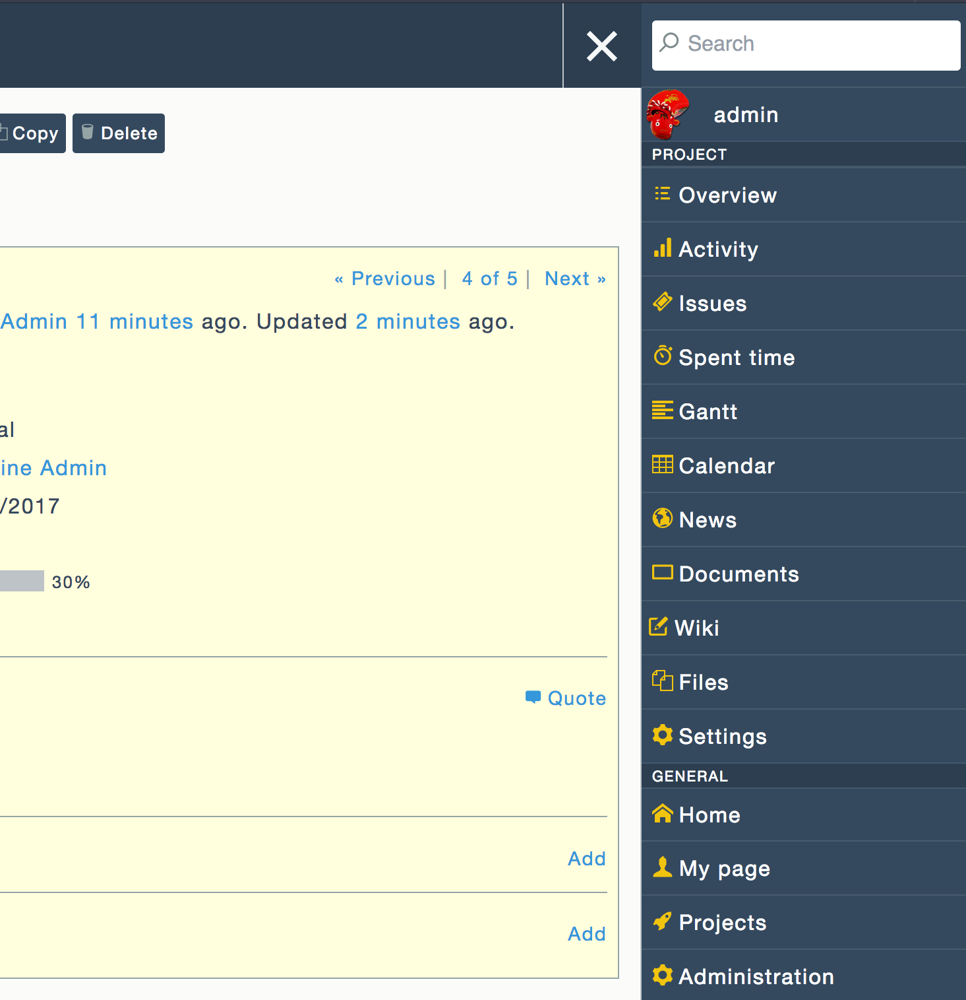

# minimalflat2

Minimal and flat design theme for Redmine.

## Screenshot

|Projects|Editor|
|:-:|:-:|
|||

|Issue|Settings|
|:-:|:-:|
|||

|Mobile|Menu|
|:-:|:-:|
|||

## Features

* Minimal and flat design
* Modern color scheme by [Flat UI](http://designmodo.github.io/Flat-UI/) & [Espresso](https://github.com/mbadolato/iTerm2-Color-Schemes)
* Flexible (resolution-independent) icon by [IcoMoon](https://icomoon.io/)
* Expandable tree view of the project list
* Favicon (Redmine 2.5 or later)
* Responsive layout (Redmine 3.2 or later)

## Installation

1. Download zip file from [release page](https://github.com/akabekobeko/redmine-theme-minimalflat2/releases)
2. Extract zip file, and move to `public/themes/minimalflat` at Redmine directory
3. Open Redmine page, and go to **Administration > Settings > Display**
4. Enable the **minimalflat2** from **Theme**, and **save** settings

## Development

Transpile (watch) CSS and preview on web browser.

1. `git clone https://github.com/akabekobeko/redmine-theme-minimalflat2.git`
2. `cd redmine-theme-minimalflat2`
3. `npm i`
4. `npm start`

### docker-compose

1. `docker-compose up -d`
2. Access to http://localhost:8080/ on web browser
3. Sign in to Redmine as an administrator
4. Select `mytheme` as the theme from the administration screen.

Stop is `docker-compose stop`.

## Libraries

|Library|Author|License|
|:--|:--|:--|
|[IcoMoon - Free](https://icomoon.io/#icons)|[Keyamoon](http://keyamoon.com/)|GPL/CC BY 4.0|
|[Entypo](http://www.entypo.com/)|[Daniel Bruce](http://danielbruce.se/)|CC BY-SA 4.0|
|[bymathias/normalize.styl](https://github.com/bymathias/normalize.styl)|[Mathias Brouilly](http://mathias.brouilly.fr/)|MIT|

## Support policy

This theme supports only to the latest version of Redmine. For Redmine, the composition of HTML and CSS is big changed for each minor version. Therefore it is difficult to support to multiple versions at the same time.

Please use the old version when you need past Redmine support.

## ChangeLog

* [CHANGELOG](CHANGELOG.md)

## License

* [GNU GENERAL PUBLIC LICENSE Version 2](LICENSE.txt)
